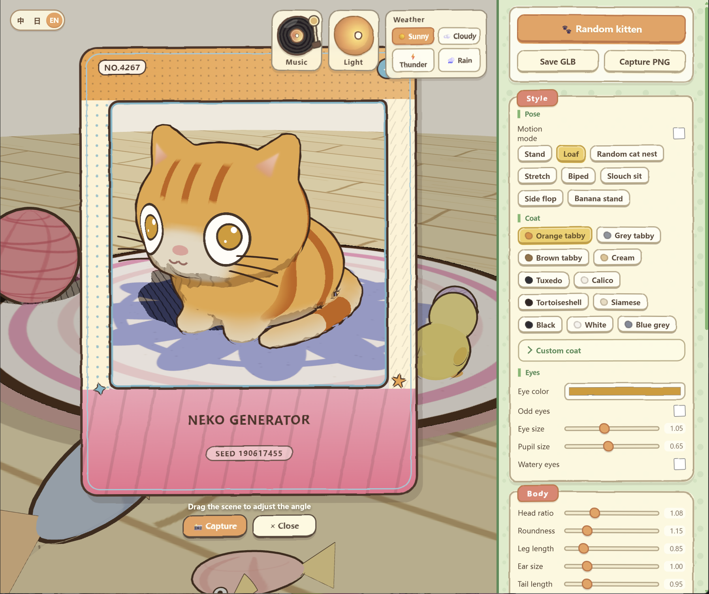

<div align="center">

# Neko Generator

[中文](README.md) · **English** · [日本語](README.ja.md)

A playful procedural 3D kitten generator for shaping bodies, designing coats, playing with toys, changing weather, trying motion, and creating collectible cards.

[Live Demo](https://ringhyacinth.github.io/Neko-Generator/) · [Report an Issue](https://github.com/ringhyacinth/Neko-Generator/issues)

</div>



## About Neko Generator

**Neko Generator** is co-created by **Simon_阿文 (Simon Lee)** and **Ring Hyacinth (海辛)**. Every kitten is procedurally generated from a seed and editable parameters. Reusing the same seed recreates the same body, coat, pose, toys, rug, collection number, and rarity.

The project is a local-first browser experience. It requires no account and has no backend service.

## Inspiration


Neko Generator began with a real kitten in our everyday life. Its rounded body and curled resting pose—together with the scratcher, fish toys, woven rugs, and bright household colors—became the starting point for the project’s character shapes, scenes, toys, and palette.

## Features

- Procedural SDF body with adjustable proportions, roundness, legs, ears, tail, and fluff
- 11 coat presets plus custom colors and pattern controls
- Eye color, heterochromia, pupil size, and watery-eye deformation
- Multiple static forms with gentle idle motion
- Experimental Motion mode with a 19-bone rig and 14 animation clips
- Hand-drawn outlines, cel shading, and configurable hatch shadows
- Physics toys including fish, ducks, yarn balls, cat beds, and more
- Sunny, cloudy, thunder, rain, and fish-rain scene states
- GLB export and collectible PNG kitten cards
- Chinese, English, and Japanese interfaces
- Desktop and mobile layouts

## Collectible Kitten Cards

Opening **Capture PNG** reads the current kitten’s base coat, primary and secondary pattern colors, and eye color to create its default card theme.

Each kitten receives:

- a stable collection number, such as `No. 2902 / 9999`
- a deterministic `R`, `SR`, or `AR` rarity derived from its seed
- a default palette sampled from the kitten itself
- optional dot, check, confetti, and wave themes through **Change Skin**
- the public repository address printed on the exported PNG so the project can be found again

## Run Locally

Requires Node.js 20.19+ or 22.12+.

```bash
npm install
npm run dev
```

Then open <http://localhost:8791>.

Production build:

```bash
npm run build
npm run preview
```

## Tests

```bash
npm run test:share
npm run test:fish-pick
npm run test:poke
npm run test:motion
```

The Motion test covers all 14 animation clips, the 19-bone rig, skin weights, state-machine inputs, and source-animation sampling.

## Controls

- Left-drag: orbit the camera
- Mouse wheel or trackpad: zoom
- Right-drag: pan
- Drag toys: grab and throw
- Drag the cheeks or rear interaction area: soft-body poke
- Drag the back of the neck: lift the kitten
- Motion mode: use `WASD` or the arrow keys; action shortcuts appear in the Motion panel

## Project Structure

- `src/sdf.js` — SDF primitives and Surface Nets meshing
- `src/catBuilder.js` — kitten construction, coat rendering, and facial details
- `src/coats.js` — coat, eye, and pose definitions
- `src/rug.js` — seed-based rugs and palettes
- `src/toys.js` — Cannon-es toy physics and grabbing
- `src/weather.js` — weather, lightning, rain, clouds, and falling fish
- `src/shareCard.js` — collectible card themes and PNG generation
- `src/mesh2motion*.js` — motion sampling, retargeting, rigging, and skinning
- `src/i18n.js` — Chinese, English, and Japanese interface copy

The app has no backend. Runtime state and exports remain in the browser or on the user’s device; the project includes no analytics or account system.

## Creators

Neko Generator is made by Simon_阿文 (Simon Lee) and Ring Hyacinth.

### Simon_阿文 (Simon Lee)

- [Twitter / X](https://x.com/simonxxoo)
- [Weibo](https://weibo.com/u/1757693565)

### Ring Hyacinth / 海辛

- [Twitter / X](https://x.com/ring_hyacinth)
- [Instagram](https://www.instagram.com/ringhyacinth/)

For future-version development or collaboration proposals, contact [ringhyacinth@gmail.com](mailto:ringhyacinth@gmail.com).

## Assets, Attribution, and License

- The application design, procedural kitten system, interface, original visual assets, and generated BGM were created for this project by Simon_阿文 (Simon Lee) and Ring Hyacinth.
- Compact feline motion data in `src/mesh2motionClips.json` is derived from [Mesh2Motion](https://mesh2motion.org/) fox/cat assets released under [CC0 1.0](https://github.com/Mesh2Motion/mesh2motion-assets/blob/main/LICENSE). See [`third_party/mesh2motion/README.md`](third_party/mesh2motion/README.md).
- Three.js, Cannon-es, Vite, and their transitive dependencies retain their respective licenses.

Except for third-party material identified separately, this project is licensed under the [MIT License](LICENSE). You may use, copy, modify, merge, publish, distribute, sublicense, and sell copies of the project under the license terms, provided that the original copyright and permission notice are retained.

## Status

The web version is an actively developed creative-tool prototype. The Motion section is explicitly experimental. Extreme body parameters, long-running WebGL sessions, and mobile performance may vary by device.

Reproducible bug reports and feedback are welcome.
